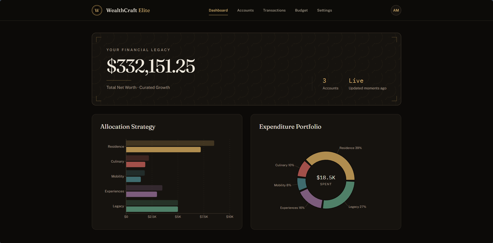
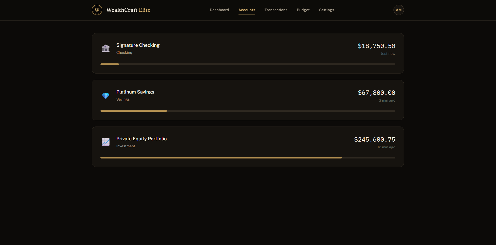
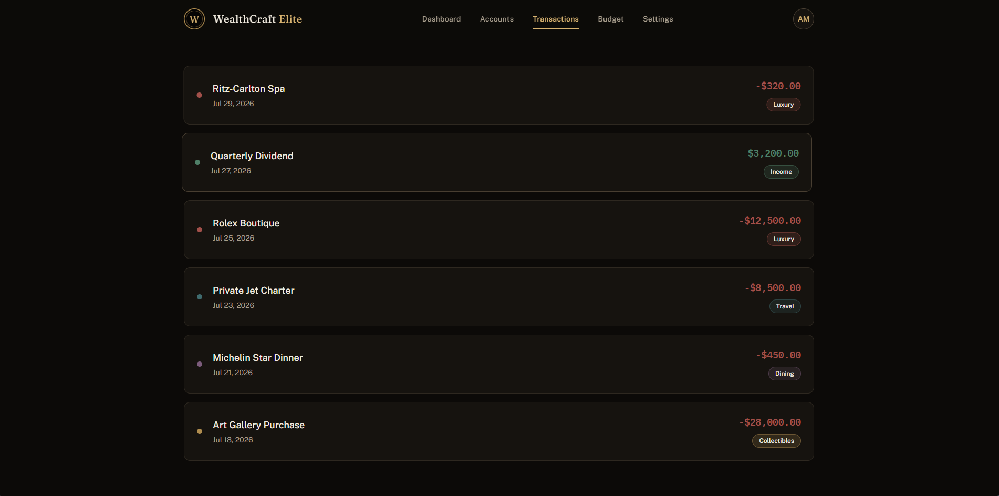
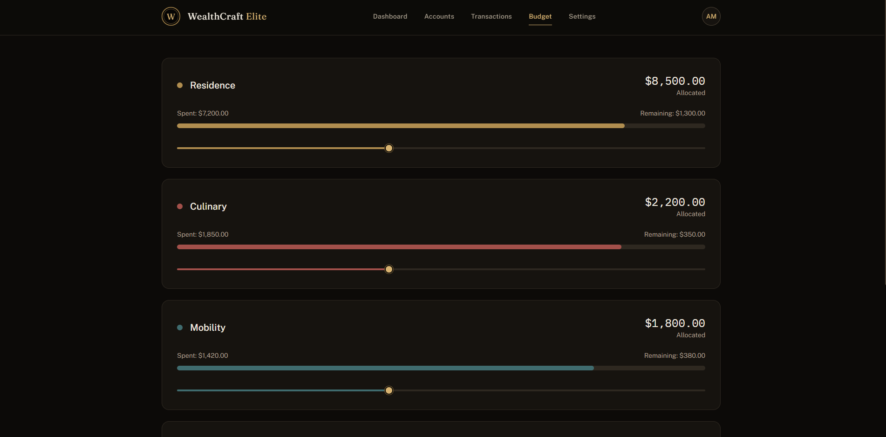
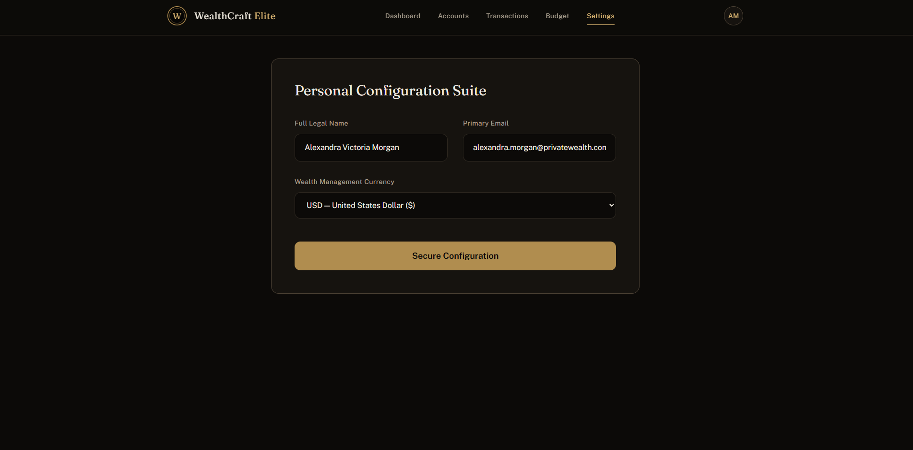

# Budget Dashboard

A personal-finance dashboard built with **React 19 + Vite** — animated
account cards, spending charts, and smooth micro-interactions.

Built as a focused frontend exercise: component composition, hooks-based
state, and data visualization. It runs on **mock data by design** — the data
layer is one swap away from a real API.

---

## 📸 Screenshots

### Dashboard Overview

> `screenshots/dashboard.png`


> `screenshots/dashboard1.png`


> `screenshots/dashboard1.png`


> `screenshots/dashboard1.png`


> `screenshots/dashboard1.png`


---

## Stack

- React 19 (hooks: useState, useEffect)
- Vite
- Tailwind CSS v4 — via `@tailwindcss/vite`, custom design tokens in `src/index.css`
- Recharts — bar and pie charts bound via `dataKey`
- Framer Motion — transitions, animated numbers

## Run

```
npm install
npm run dev
```

## Roadmap

Persistence (small API or localStorage), category budgets with alerts, and
CSV import — which would connect this straight to my
[data-quality-pipeline](../data-quality-pipeline).
